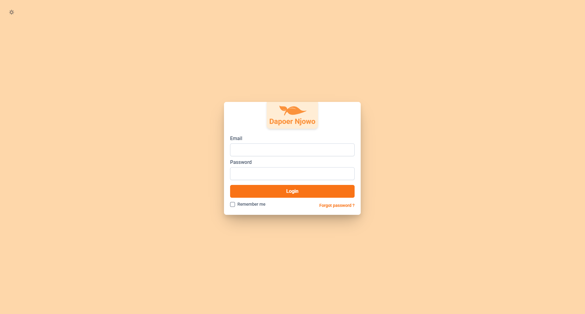
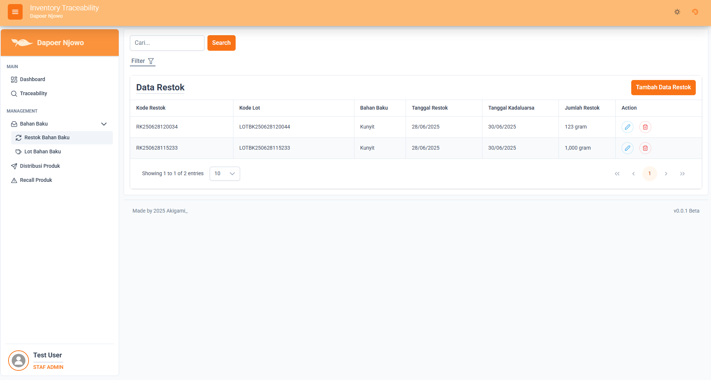
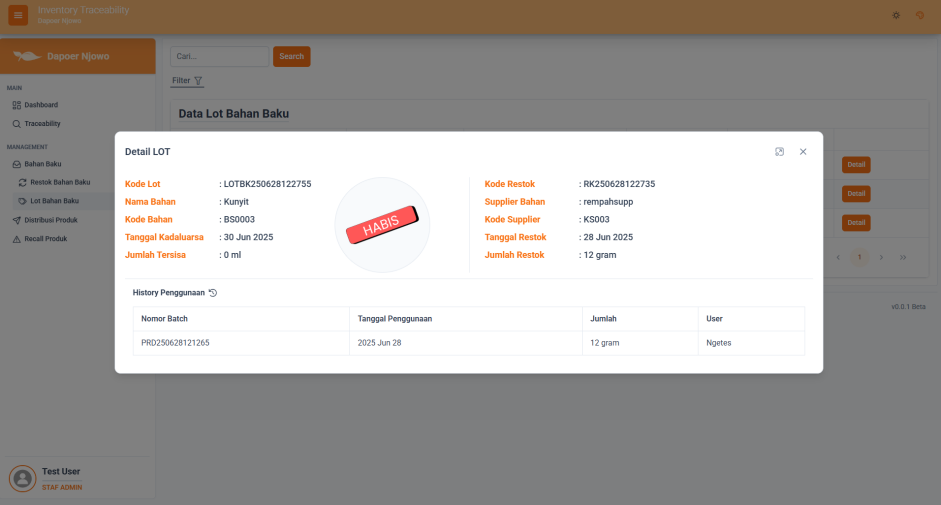
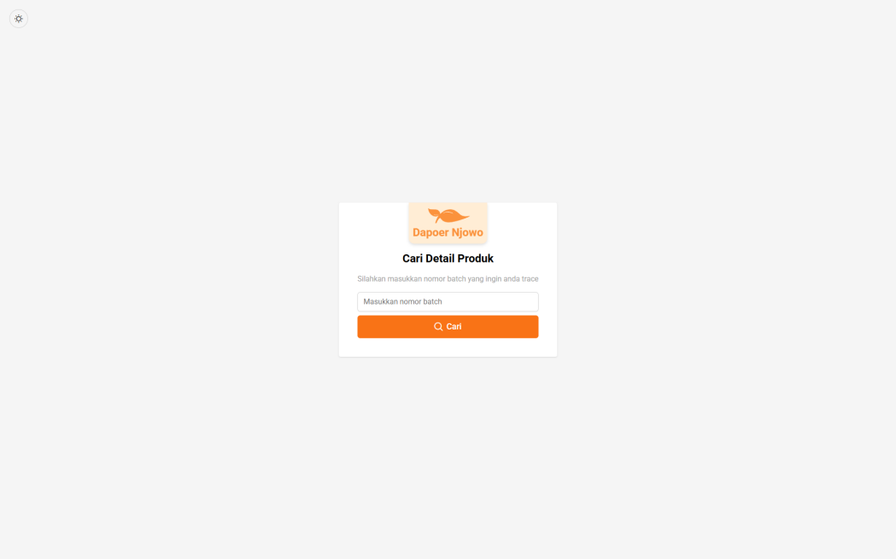
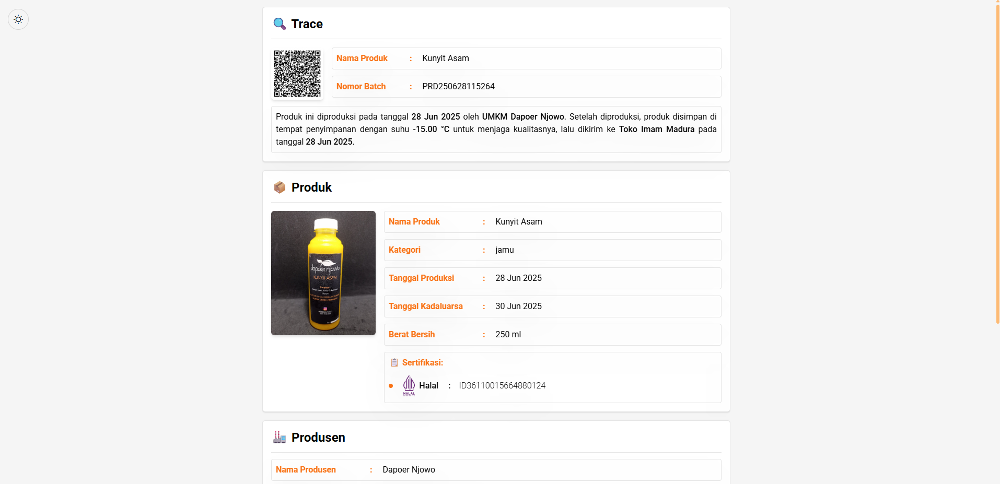

# Aplikasi Inventory Traceability - Dapoer Njowo

This was my **final college project**, built for a local **UMKM (Usaha Mikro, Kecil, dan Menengah)** named *Dapoer Njowo*.  
The purpose of this project was to help the business manage its **inventory and product traceability** using a simple web-based system.

Although the app was not deployed for daily use, it served as a complete learning experience in both backend and frontend development, and taught me a lot about system design and architecture.

---

## 🇮🇩 Deskripsi (Bahasa Indonesia)

Proyek ini merupakan **tugas akhir kuliah** yang saya buat untuk **UMKM Dapoer Njowo**.  
Tujuannya adalah untuk membantu pengelolaan **stok bahan baku, produk, dan pelacakan (traceability)** melalui sistem berbasis web.

Aplikasi ini belum digunakan secara aktif oleh UMKM terkait, namun proses pembuatannya memberikan pengalaman nyata dalam pengembangan web full-stack dan perancangan arsitektur sistem.

---

## 🧩 Tech Stack
- **Laravel + Vue (Inertia.js)** — aplikasi utama (monolith)  
- **FastAPI (Python)** — untuk pembuatan **QR Code dinamis**  
- **MySQL** — database utama  
- **Bootstrap & Tailwind CSS** — tampilan antarmuka  

---

## ⚙️ Fitur Utama
- Manajemen data produk dan stok  
- Pelacakan produk melalui **QR Code dinamis**  
- CRUD data bahan baku dan produk  
- Dashboard admin sederhana untuk memantau stok  

---

## 🧠 Lessons Learned / Pembelajaran
- Integrasi dua backend (Laravel dan FastAPI) memungkinkan fleksibilitas, namun meningkatkan kompleksitas.  
- Memahami perbedaan dan trade-off antara arsitektur **monolith** dan **API-based**.  
- Belajar membuat komunikasi antar framework (PHP & Python).  
- Menyadari bahwa kebutuhan bisnis sering kali berbeda dari rancangan akademik.

---

## 🚀 Future Improvements / Rencana Pengembangan
- Rebuild penuh menggunakan **FastAPI + Vue** atau **FastAPI + React** untuk struktur yang lebih bersih.  
- Tambah fitur autentikasi dan manajemen QR yang lebih efisien.  
- Perbaikan struktur database dan modularisasi kode.  
- Deploy sistem agar dapat digunakan oleh UMKM sesungguhnya.

---

## 🧾 About This Project
This project was part of my academic journey and represents one of my earliest full-stack implementations.  
Even though it’s not currently in production, it reflects my effort to apply technology to real-world business needs.

---

## 📸 Screenshots / Tampilan Aplikasi
# Login page:

# Restok Bahan Baku page:

# Lot Bahan Baku Detail (popup) page:

# Trace page:

# Trace Detail Result page:

---

### 🏷️ Keywords
`Laravel` `Vue` `FastAPI` `Inventory Management` `QR Code` `Traceability` `UMKM`

